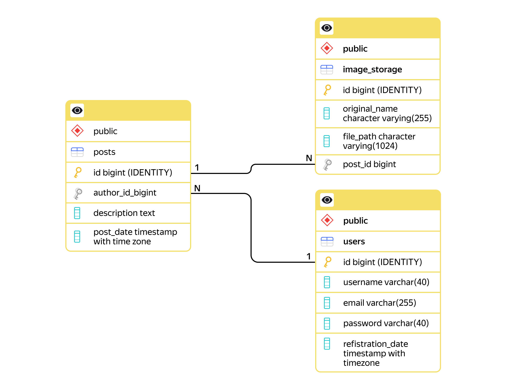

# Catsgram

## Описание проекта

**Catsgram** — это учебный проект веб-приложения на **Java** с использованием **Spring Boot**, демонстрирующий принципы построения **RESTful API** и работы с базой данных. Сервис позволяет пользователям регистрироваться, публиковать посты с описаниями и загружать к ним изображения.

Цель проекта — освоение ключевых концепций современной бэкенд-разработки, включая работу с базами данных, контейнеризацию с помощью Docker и построение многослойной архитектуры приложения.


## Ключевые технологии

*   **Java 21**
*   **Spring Boot 3.2.2**
*   **Spring JDBC** (использование `JdbcTemplate`)
*   **PostgreSQL** (в качестве базы данных)
*   **Docker** и **Docker Compose** (для контейнеризации и оркестрации)
*   **Maven**
*   **Lombok**

## Архитектура и возможности

Проект демонстрирует современную многослойную архитектуру:

*   **Controller Layer:** Обработка HTTP-запросов и ответов.
*   **Service Layer:** Реализация основной бизнес-логики.
*   **Data Access Layer (DAL):** Изолированный слой для взаимодействия с базой данных с помощью паттерна **Repository**.
*   **DTO (Data Transfer Object):** Использование отдельных объектов для передачи данных между слоями и клиентом, что обеспечивает безопасность (например, пароли не утекают в API) и гибкость.

### Структура базы данных

Взаимосвязь основных сущностей (`users`, `posts`, `image_storage`) выглядит следующим образом:



## Как запустить проект

Для запуска проекта необходим установленный **Docker** и **Docker Compose**.

1.  **Клонируйте репозиторий:**
    ```bash
    git clone https://github.com/bolshovaelizaveta/Catsgram.git
    cd Catsgram
    ```

2.  **Создайте файл конфигурации `.env`:**
    В корневой папке проекта создайте файл с именем `.env` (этот файл находится в `.gitignore` и не попадет в репозиторий). Скопируйте в него содержимое из файла-примера `.env.example` и задайте пароль:
    ```env
    POSTGRES_DB=catsgram
    POSTGRES_USER=dbuser
    POSTGRES_PASSWORD=supersecret # Замените на свой сложный пароль
    ```

3.  **Соберите Java-приложение:**
    С помощью Maven соберите проект в исполняемый `.jar` файл.
    ```bash
    mvn clean package
    ```

4.  **Соберите Docker-образ приложения:**
    ```bash
    docker build -t catsgram-app .
    ```

5.  **Запустите всю систему (приложение + база данных):**
    Используйте Docker Compose для запуска всех сервисов.
    ```bash
    docker compose up -d
    ```
    Эта команда запустит контейнер с PostgreSQL и контейнер с вашим приложением. При первом запуске также будет выполнен скрипт для создания таблиц в базе данных.

Приложение будет доступно на `http://localhost:8080`.

## Эндпоинты API

Все запросы отправлять на `http://localhost:8080`.

### Пользователи (`/users`)

*   `POST /users`: Создать нового пользователя.
    *   _Тело запроса (`NewUserRequest`):_ `{ "username": "TestUser", "email": "test@example.com", "password": "password" }`
    *   _Ответ (`UserDto`):_ `201 Created` с данными пользователя (без пароля).
*   `GET /users`: Получить список всех пользователей.
*   `GET /users/{userId}`: Получить пользователя по его ID.
*   `PUT /users/{userId}`: Обновить данные пользователя.
    *   _Тело запроса (`UpdateUserRequest`):_ `{ "username": "UpdatedUser" }` (можно обновлять любые поля).

### Посты (`/posts`)

*   `POST /posts`: Создать новый пост.
    *   _Тело запроса (`NewPostRequest`):_ `{ "authorId": 1, "description": "Мой первый пост!" }`
    *   _Ответ (`PostDto`):_ `201 Created` с данными поста.
*   `GET /posts/{postId}`: Получить пост по его ID.
*   `PUT /posts/{postId}`: Обновить описание поста.
    *   _Тело запроса (`UpdatePostRequest`):_ `{ "description": "Новое описание поста." }`

### Изображения

*   `POST /posts/{postId}/images`: Загрузить одно или несколько изображений для поста.
    *   _Тип запроса:_ `multipart/form-data`
    *   _Ключ для файлов:_ `image`
*   `GET /images/{imageId}`: Скачать изображение по его ID.
    *   _Возвращает файл (бинарные данные), а не JSON._
